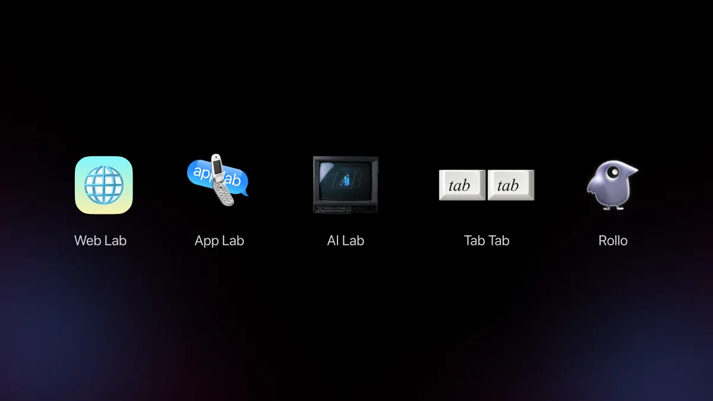
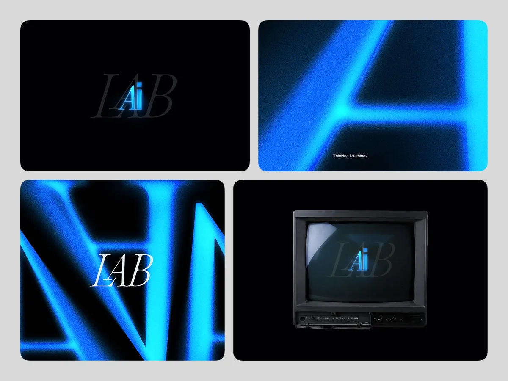
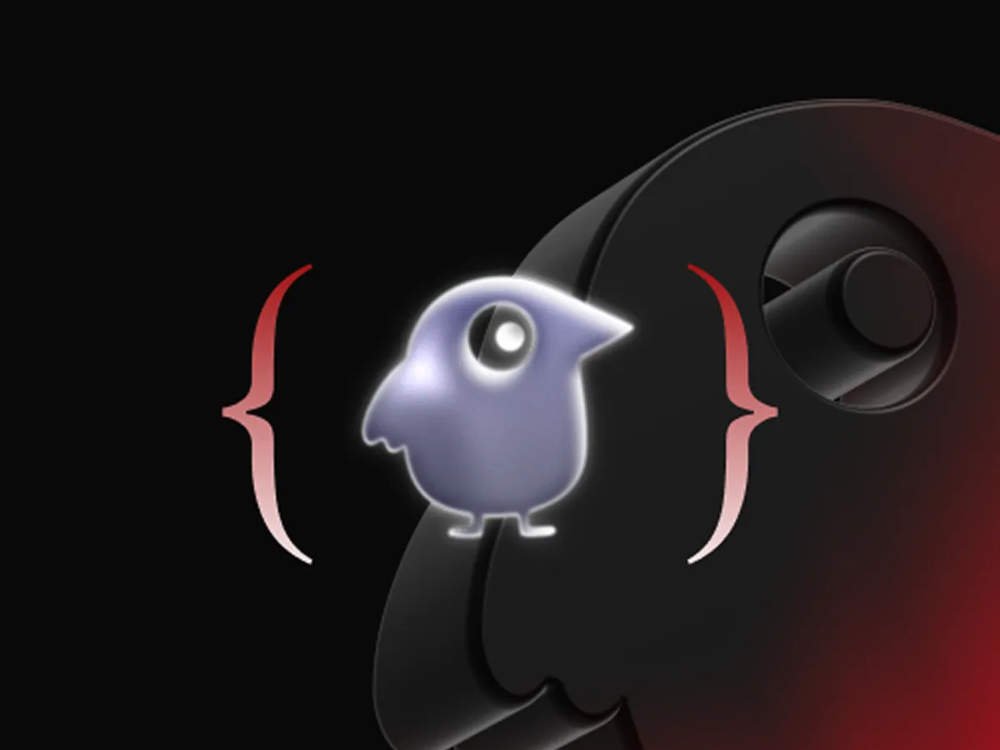

# Lab : Thinking Out Loud, in Code

Most ideas don’t make it into a roadmap. Too small to propose, too uncertain to defend. So they sit in the back of your mind, in a figma comment nobody followed up on *(you know the ones)*.

A lab is different from a project. There’s no outcome to defend, no brief to stay inside. It’s just a container for curiosity, a place where an idea can be tested without needing to justify itself first *(just you and the idea)*.

That’s what I built. Web Lab, App Lab, AI Lab *(three places for ideas to finally move a little)*.

## Web Lab

Figma prototypes have a ceiling.

You can nail the layout, obsess over the colors, and fake the motion reasonably well. But you can't feel the weight of a scroll in a frame. And you can't truly know if a micro-interaction actually lands until it’s running in the real product.

Trying to prove how a design feels inside a static review is exhausting. The moment you have to write a paragraph explaining why an interaction is delightful, half the magic is already gone.
So, I stopped trying to simulate it and just started building directly in the codebase.

Take the watchlist button for The Bear. The show is chaotic, raw, and full of emotion, just a beautiful, messy grind of a kitchen. A generic "Added to Watchlist" pop-up on that felt way too... normal (Yes, Chef).

Instead, I coded a tiny interaction: when you tap to save the show, it physically sprinkles a pinch of salt over the button before it lands in your list. It’s completely unnecessary, which is exactly why it works. It takes a boring, transactional click and turns it into a fleeting moment of delight that connects you straight to the vibe of the show. Pitch a "salt animation" in a Figma review, and it dies instantly as "out of scope" (priorities, right?). But the second it was alive in the browser? The 'why' answered itself.

That’s what Web Lab is for.

It’s not a space to ship production code. It’s a dedicated sandbox to find out what's actually possible when we stop designing around limitations that don't need to exist. Because sometimes, the best design decisions aren't the ones you can present on a slide, they're the ones you just have to feel.

Check out [Web Lab](https://shreeramk.com/web-lab/) to see the rest of the experiments.

## AI Lab

### Tab Tab

Copy is invisible when it works. You don't notice "Continue Watching", you just press it. You don't register "Because you watched", you just feel like the product knows you. But subconsciously, copy is doing a lot. It shapes how a brand feels, how a moment lands, whether a person stays or leaves.

Our product had a copy guide. Good one, actually. But it was verbose, easy to ignore under deadline pressure, and impossible to keep in your head while writing *(so most didn't)*. One team wrote "Oops!" Another wrote "Error occurred." Same product, different voices. The experience scattered without anyone noticing.

Tab Tab fixes that quietly. The copy guide becomes the brain. Tab Tab uses it as context, understands the UI element you're writing for, and generates copy that sounds like one person talking across the whole product. Consistent, on-brand, without anyone having to memorise a guidelines doc.

Tap tab twice and the right words appear *(that's a beautiful thing for two little tabs to do).*

### Rollo

Motion is one of those things you rarely notice when it's done well. But the moment it feels slightly off, everything else does too. A button feels heavy. A sheet feels abrupt. A transition feels... generic. Nothing is technically broken, but the product quietly loses a bit of its personality (you know the feeling).

Default easing curves in Figma are perfectly fine (which is exactly the problem). They work for almost everything, but they don't feel like your product. They just... move.

We knew how our product should feel. Springy in some places, deliberate in others. We had a shared intuition, but intuition doesn't scale very well (someone eventually asks, "which curve did you use?"). So we turned that intuition into a system, motion principles, easing curves, and guidelines for how different interactions should move.

That's where Rollo comes in. Describe the interaction, the context, and how it should feel, and it generates a custom Bézier curve based on those principles (goodbye graph editor gymnastics). Copy it straight into Figma or grab the code. No more reaching for the default simply because it's the fastest option.

The goal was never to make motion fancier. Just more intentional. When the motion starts feeling like it belongs to the product instead of the design tool, you've probably got it right.

## App Lab

"Not feasible" is a phrase that ends a lot of good ideas.

Sometimes it's true. But sometimes it just means nobody's tried it yet or tried it properly. App Lab was built for that gap. A space to experiment with app interactions at a level closer to production than a Figma prototype, close enough to actually stress-test what's possible.

Using Figma MCP to generate native components, then pushing them, adding delight, layering micro interactions, seeing where things break and where they don't. It changed the conversation with engineering. Less "can we do this?" and more "look, it's already running."

Feasibility is easier to argue when something is in front of you *(and harder to dismiss).*

The lab mentality is a specific kind of freedom.

No one to report to. No timeline forcing a half-baked experience out the door. Just an idea, the curiosity to follow it, and enough space to see where it actually goes *(which is the part most processes skip).*

If you want to fork it and experiment a little yourself, feel free to explore [App Lab on GitHub](https://github.com/shree5k/app-lab).

That's what these labs gave me. Not features, not deliverables, the pure joy of building something until it feels right. Of seeing an idea come alive on its own terms.
