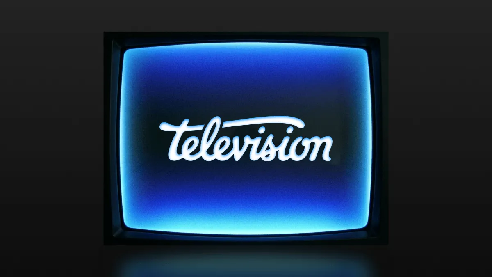
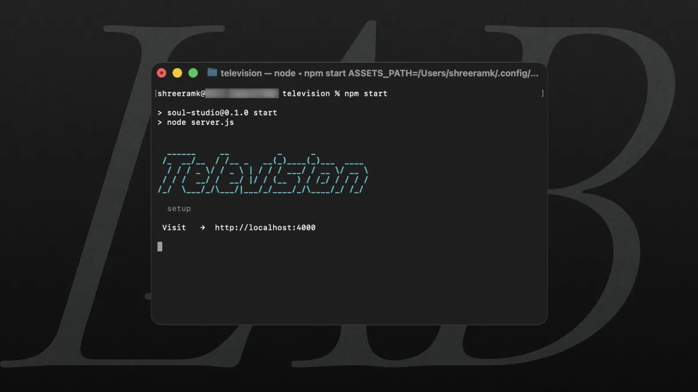
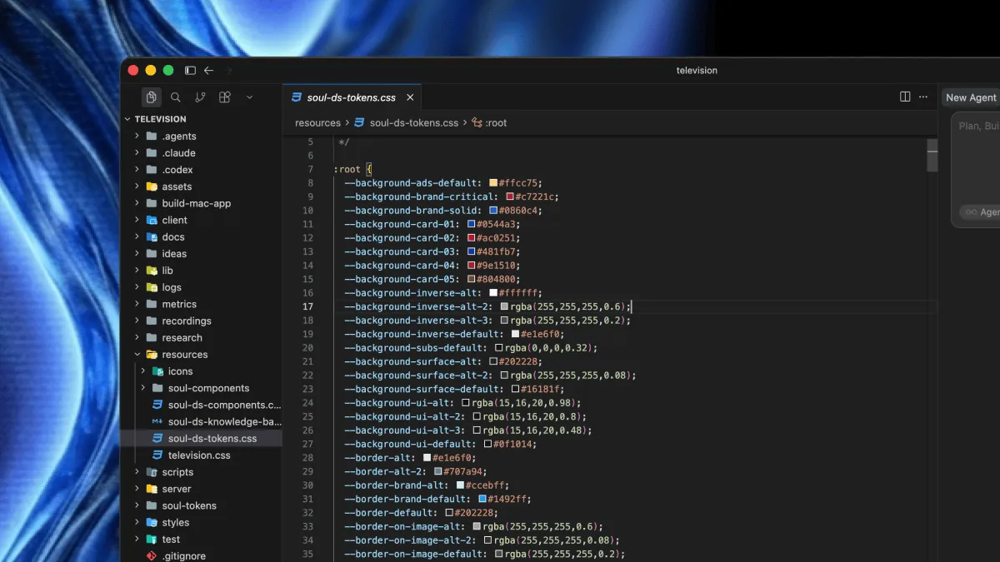

# Television : AI Design Playground at JioHotstar



Every idea loses a little of itself on the way into someone else’s mind. You’ve probably felt it, you know exactly what you’re imagining, you can almost see it, but the friction isn’t coming up with the idea, it’s helping someone else see the same thing.

That got me thinking about the different mediums we’ve invented over the years to do exactly that. A rough sketch, wireframes, figma, interactive prototypes, videos, or even a single image. They’re all trying to solve the same problem, translating what’s in one person’s mind into something another person can understand.

The interesting part is that every medium sits somewhere on an invisible graph between effort and understandability. A sketch is incredibly quick, but leaves a lot to the imagination. An interactive prototype communicates far more, but takes considerably more effort to build. The closer you want someone to experience your idea, the more time you usually spend bringing it to life, that’s been the trade-off for years.

Lately, though, it feels like that graph has shifted a little. For the first time, communicating an idea doesn’t demand the same level of effort it once did. I’ve found myself thinking of AI less as another tool and more as another medium. Every medium we’ve invented has moved that graph in some way, helping us preserve a little more of the original idea. AI feels like the next step in that story. Expressing an idea takes lot less time (cost... that's a separate conversation).

That’s how **Television** came about. I wanted to explore what this medium could unlock to me and our team. Could it help translate an idea into something people could actually experience while it was still fresh? Something close enough that very little gets lost on its way into someone else’s mind.

## Building with Television

Television turns a idea into a working prototype, then lets you refine it through conversation.

You describe a screen. It generates a real, interactive HTML prototype. You interact with it, notice what’s wrong, and ask for the next pass. The first generation is rarely the point. The second, third, and fourth passes are where the tool has to prove itself.

The output is not a chat message or a proprietary canvas state. It is a real HTML file on disk. You can open it, fork it, edit it by hand, commit it, zip it, or send it to someone else. It behaves like any other creative artifact.


## Core Principles

1. **Constraints are a form of care**
   Unconstrained models produce noise. Good constraints give models permission to be taste driven.
2. **The artifact is the prototype**
   No hidden database states or abstract canvas schemas. The output is a file.
3. **System compounding over one off generation**
   A screen solves one problem, a reusable component improves every screen generated after it.
4. **Prompting is software architecture**
   What the model reads, skips, remembers, and writes should be engineered like a runtime contract.

## Generate

**Soul Design System as model control engine**

The first pass is broad on purpose. Television uses the `/idea` contract in `[.claude/commands/idea.md]` to shape what generation means. The model is not asked to jump straight into code. It is asked to establish intent, vibe, component selection, a signature interaction, and a design quality pass before it writes anything.

That matters because freeform generation is usually too eager. Without structure, the model starts solving the wrong problems too early. Television gives the first pass enough context to behave like composition, not improvisation.

At a high level, the contract looks like this:

```jsx
function buildIdeaTask(userPrompt) {
  return `
    INTENT
    VIBE
    COMPONENT SELECTION
    SIGNATURE MOMENT
    DESIGN QUALITY PASS

    Then write to ideas/{Name}/{Name}.html
  `;
}
```



## Refine

**Prompting as product architecture**

Refinement is where Television gets more interesting. The system treats refinement as a different kind of work from generation. It does not assume that every change deserves the full design system context. For updates, the tool tries to stay narrow, read the current idea, make the smallest satisfying change, and avoid pulling in unnecessary prompt weight.

To keep iteration instant, Television splits its prompting contract into two modes:

- **Generate Mode:** Reads the complete Soul knowledge base to build a screen from scratch.
- **Update Mode:** Skips reloading design-system docs and CSS files. It reads *only* the target HTML file and applies a surgical diff.

```jsx
function buildPrompt({ prompt, isUpdate }) {
  if (isUpdate) {
    return `
      Read only the current idea file.
      Skip the full design-system knowledge base.
      Make the smallest satisfying change.
    `;
  }

  return `
    Read the full design-system contract.
    Compose a new screen from the system.
  `;
}
```

This makes a big difference in practice. The distinction is simple, but it has real product consequences. Where managing context size as a product feature reduced token costs and kept tiny tweaks (like changing a button label) from triggering a full UI rewrite.


## Code Native Foundations

One thing that became obvious very quickly is that models should not be trusted to reinvent standard UI on every pass. Buttons should not be rediscovered. Typography should not be rediscovered. Bottom Sheet, spacing, Nav behavior, Image treatment, Dimensions, and loading states should not be rediscovered either.

What mattered here was not only giving the model a set of design rules. It was building code native foundations and reusable parts that both humans and models could work against.

That is what Soul Design System is.

Soul is not just a design system sitting beside the tool. It is a layered component architecture inside the tool. The load order in `[server/config.js]` makes that explicit:

```jsx
export const SOUL_LOAD_ORDER = ['core.js', 'primitives.js', 'blocks.js', 'fixtures.js'];
```

That order tells you what kind of system this is:

- `resources/soul-components/core.js` holds foundational wrappers and base APIs like Stack, Text, Image, Button, BottomNav, and tabs.
- `resources/soul-components/primitives.js` holds reusable behavior and UI utilities like useSimulatedLoad, Skeleton, PosterCard, FadeSwitch, StaggeredList, BottomSheet, FilterPill, ScrollCarousel, Tray, SlideIn, and HeroCarousel.
- `resources/soul-components/blocks.js` holds composed product sections like IconButton, HeroSection, Hero, PlayerMini, FilterShelf, and DetailHeader.
- `resources/soul-components/fixtures.js` holds the shared data layer, poster fixtures, bottom-tab config, and reusable sample content.



Even the smallest pieces are real code, not abstract names:

```jsx
function Stack({ direction = "vertical", gap = "00", children, ...rest }) {
  return (
    <div className="soul-stack" data-direction={direction} data-gap={gap} {...rest}>
      {children}
    </div>
  );
}
```

The visual contract lives in `[soul-ds-components.css]`, where `.soul-*` classes define the reset, spacing model, typography system, image ratios, button behavior, and keyframes. The system is then surfaced publicly through `[soul-components/component-gallery.html]`, which powers `/44` as a live inspection layer for the reusable component set.

That is why Soul feels more substantial than a style guide. It is authored infrastructure. The rules in `[soul-ds-knowledge-base.md]` push standard structure back into those shared parts:
This is why the loop stays tighter. The model is not spending every pass rediscovering system behavior. The system is already carrying that load.


## Real Artifacts

**The file is the prototype**

The format of the output matters more than it first appears. It decides if the prototype can leave the tool, if someone else can open it without friction, and if small changes feel easy or constantly fight the medium.

I tried structured JSON, React components, and higher-level UI descriptions. Each one worked until it didn’t. Editing became awkward. Inspection got harder. Simple changes started requiring too much overhead. HTML was the one that held up. It wasn't the most fashionable choice (if anything, the opposite), but it was the most practical. Models write it well. You can open it in a browser, change a line by hand, diff it in Git, or give it to another model later without converting it first.

That choice shaped everything after it. In Television every idea is an HTML file on disk. Not a chat message. Not some internal state. Just a file. Forking, versioning, exporting, and sharing didn’t need to be built as special features. They were already possible because the work existed as a normal file. The prototype no longer lived inside the tool. It lived on its own.

## Paste

Not every good prototype starts from a prompt.

Sometimes you already have HTML from somewhere else. Sometimes you want to bring in a rough concept and work forward from there.

Television supports that directly. You can paste or drag in HTML, save it as an idea, preview it immediately, and refine it using the same loop as generated work.

That is a small but important product decision. It keeps Television from becoming a closed world where only model-originated ideas are first-class.


## Fork

Forking turned out to be one of the most useful parts of the tool.

When a screen is close but not quite right, or when two directions both seem worth pursuing, the right move is often not “keep editing.” It is “branch.”

Television treats that as a normal part of the workflow. A saved idea can become Name-fork-N, preserving the original while opening space for another pass in a different direction.

This is one of those features that sounds operational but is really creative. It makes exploration safer.


## Stage

A generated screen is only as useful as the environment it runs in.

I learned that one the hard way.

Early on, every prototype carried its own little world. Different React versions. Different Babel imports. Different copies of the same Soul components. Most of the time it worked. Sometimes it didn't (those were fun afternoons).

So Television stopped treating previews as "open this HTML in an iframe" and started treating them as a controlled runtime.

Before anything renders, `server/html.js` quietly prepares the stage. Remote React, ReactDOM and Babel references are rewritten to local pinned versions. `text/babel` blocks are normalized. Shared Soul components are injected into the same scope as the generated screen, and styles or scripts can be inlined whenever a standalone bundle is needed.

One part I particularly like is the shared component injection:

```jsx
function injectSharedComponents(html, componentsCode) {
  return html.replace(
    /<script[^>]+data-soul="screen"[^>]*>([\s\S]*?)<\/script>/,
    (_, screenCode) => `
      <script type="text/babel">
        ${componentsCode}
        (() => {
          ${screenCode}
        })();
      </script>
    `
  );
}
```

It looks simple, but it changes a lot. Generated screens stay focused on the experience they're trying to describe, while the runtime quietly provides everything around them. Update a Soul component once, and every prototype picks it up automatically the next time it's opened.

The preview pipeline does three things:

- **Vendor pinning.**
  Remote React, ReactDOM and Babel references are rewritten to local, pinned versions.
- **Runtime component injection.**
  Shared Soul components are injected at runtime, so generated files don't need to repeat component boilerplate.
- **Central system propagation.**
  Changes to Soul components automatically flow across every generated prototype.

That consistency turned out to matter more than I expected. If the stage changes every time, you're never quite sure whether you're improving the screen or debugging the environment.

## System Compounding

**Changing the unit of learning**

One of the most ambitious parts of Television is that it isn’t only trying to generate screens—it’s trying to improve the system that generates them.

Most AI design tools treat every reference as a one-off prompt. You paste a Figma link or a screenshot, the model generates a screen, and that knowledge disappears into a single HTML file. The next time you need that pattern, the model has to reinvent it from scratch.

Television takes a different approach through a repo-native skill called $component-builder.

Instead of treating design references as temporary inspiration for a single prototype, the skill converts them into permanent system primitives.

```ts
// From reference artifact to permanent system primitive
function contributeComponent(reference){
  const design = inspectReference(reference);          // Figma AST JSON or screenshot fallback
  const target = resolveTargetComponent(design);       // Auto-match existing component if updating
  const mapped = mapToExistingSoulPatterns(design);    // Reuse existing primitives first

  const layer = chooseComponentDestination(mapped);   // Route to core, primitives, or blocks
  const component = implementComponent(layer, mapped);

  publishContribution(component);                      // Update Source + CSS + KB + /44 Gallery
  return component;
}
```

This fundamentally shifts the **unit of learning** inside the tool. Without a contribution path, a design reference helps once. With a contribution path, it improves every future screen generated by the tool.

### The Architectural Guardrails

To keep the design system from turning into a dumping ground for single-use code, the skill enforces four strict guardrails:

1. **Multimodal Ingestion (API AST + Visual Fallback)**
   When provided a Figma link, a helper script (fetch_figma_node.mjs) pulls the exact frame layout AST JSON alongside a rendered PNG. If API tokens are unavailable, it falls back seamlessly to screenshot analysis. The model evaluates both structural geometry and visual intent.
2. **Intelligent Target Resolution**
   When updating existing UI, a resolver (resolve_component_update.mjs) fuzzy-matches Figma node names and spec descriptions against existing Soul component APIs. If you pass a hero banner revision, it updates the existing Hero component rather than generating a duplicate HeroV2.
3. **Strict Taxonomy & Destination Routing**
   Components aren't dumped into one giant file. The skill routes new primitives into explicit architectural layers based on scope:

```ts
// Enforcing strict design system taxonomy
function chooseComponentDestination(component){
  if (component.isLowLevelWrapper) return 'core.js';
  if (component.isReusableBehavior || component.isMotionPrimitive) return 'primitives.js';
  if (component.isComposedSection || component.isPromotedPattern) return 'blocks.js';
  if (component.isSharedSampleData) return 'fixtures.js';
  throw new Error('Unresolved component layer');
}
```

4. **Verification & Health Contracts**
   A component isn't published just because code was written. Before a component is promoted to the public Soul surface, the pipeline executes token validation (npm run check:tokens) and server health checks (check_television_server.mjs) to render a realistic preview in the /44 gallery without causing local server collisions.

**Scaling the System: From Individual to Team**

Building the `$component-builder` agent skill was only half the equation; the real leverage came from team adoption. A system only truly compounds when people actively use and shape it. To bridge that gap, I helped set up a streamlined Git workflow and conducted internal workshops to show the broader team how to engage with the architecture.

The impact shifted the culture: product designers who had historically only consumed components started actively contributing back to the Soul component library. The unit of learning didn't just shift inside the tool—it shifted across the entire team. The tool wasn't just generating screens anymore; it was generating contributors.

## Session Context

**Abstracting the agent runtime**

One thing that becomes obvious when building with AI agents is that context reuse is both powerful and dangerous.

If a system remembers too little, every iteration feels like starting over. If it remembers indiscriminately, past tasks bleed into the present and the prototype starts to feel "haunted" by ghost context from unrelated screens or previous conversations.

Good iteration depends on the system remembering the right thing, not just remembering more.

To keep refinement surgical, Television approaches multi-agent support as a true runtime abstraction layer rather than a shallow UI toggle.

### 1. Decoupling Agent Engines from the UI

Supporting multiple models shouldn't mean adding a surface-level dropdown menu. Under the hood, **Claude Code** and **Codex** CLI agents operate completely differently: distinct CLI binaries, unique execution arguments, and different output parsing strategies (stream-json vs. plain text).

Television absorbs those differences inside the server run layer (server/run.js) so the main studio interface stays completely decoupled from the backend execution engine:


```ts
// server/run.js: Unified provider map isolating agent CLIs from the studio UI
const PROVIDERS = {
  'claude-code': {
    binary: 'claude',
    parseOutput: 'stream-json',
    buildArgs(payload, resumeId) {
      return ['--print', '--output-format', 'stream-json', '/idea ' + payload];
    },
  },
  codex: {
    binary: 'codex',
    parseOutput: 'text',
    buildArgs(payload, resumeId) {
      return resumeId
        ? ['exec', 'resume', resumeId, payload]
        : ['exec', payload];
    },
  },
};
```

Because the execution logic is abstracted away:

- The /run endpoint remains a single, clean streaming entry point.
- The UI provider switcher stays friction-free.
- Preview rendering and artifact persistence remain completely agnostic to whichever provider generated the HTML.

### 2. Guarded Session Resume

To prevent context from leaking across screens or providers, session resumes are strictly guarded before any CLI transcript is re-attached (server/sessions.js):

```ts
// server/sessions.js: Guarding session resume across screens and providers
function resolveResumeSessionId(sessionId, screenName, provider){
  const entry = sessionStore.find((s) => s.id === sessionId);
  if (!entry) return '';
  if (entry.screenName !== screenName) return ''; // Prevent cross-screen bleed
  if (entry.provider !== provider) return '';     // Protect provider/model integrity
  return sessionId;
}
```

A previous session is resumed **only** when the session ID, target screen name, and active provider match strictly.

That guard is small, but it protects the entire experience of iteration: a revision to a movie detail screen will never accidentally pull context from a search flow or bleed Claude transcript state into a Codex run.


## Export

An important part of the loop is that ideas do not have to stay trapped inside the running app.

Television can bundle a prototype into a standalone HTML file with inlined local styles, scripts, and icon fonts. That matters because it lets the artifact travel without losing too much of the environment it depended on while being refined.

The distinction is subtle but important: it is not only saving source, it is packaging a runnable artifact.

That makes reviews & testing easier, and sharing more honest. The thing being passed around is still close to the thing that was refined.


## What Television taught me about craft

A log file like BUILDLOG.md contains the part of a project I trust the most: the part where a tool learns through real failure.

Over time, you see observed model mistakes get absorbed directly into system behavior—navigation stacking bugs turned into hard layout rules, poster-ratio errors converted into component props, and prompt hierarchies rearranged after watching where the model lost attention lower in the file.

Building Television reinforced three core beliefs about the future of design engineering:

1. **Environment quality beats model power**
   A focused model operating inside a tightly constrained runtime will consistently outperform a state-of-the-art model shouting into an unconstrained text box.
2. **System compounding is true leverage**
   The most impactful AI design tools aren't those that generate disposable, one-off screens. They are systems that capture good design patterns and feed them back into shared, reusable infrastructure.
3. **The evolving nature of craft**
   As AI tools mature, our role as designers expands. We aren't just drawing static frames anymore; we are designing the rules, runtimes, abstractions, and feedback loops that allow non-deterministic engines to produce high-taste work.
4. **Adoption defines impact**
   The best architecture in the world means nothing if it isolates the creator. By investing in workshops and contribution workflows, the tool became a shared language that empowered the whole team to pitch better ideas to leadership.